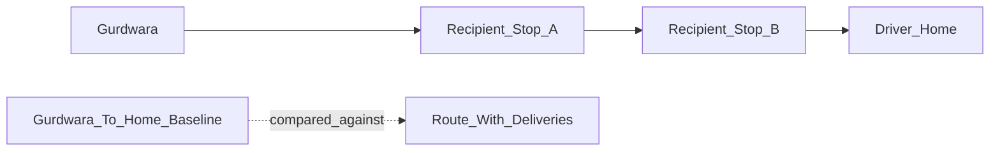
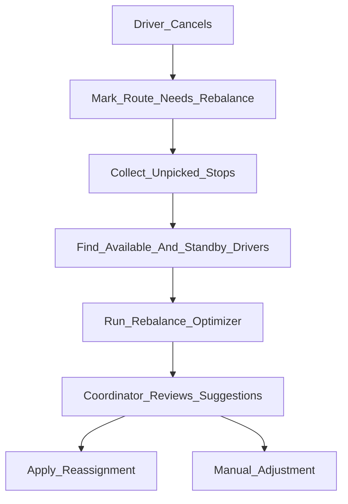

# Delivery Routing Plan

## Goal

Build a delivery routing mechanism that feels Uber-like operationally, but does not depend on Google Maps or live navigation APIs. The first version should assign approved recipient deliveries to sevadars based on where they live, where recipients are, meal capacity, delivery windows, and route fairness.

Chosen first-version assumptions:

- Drivers start at the gurdwara.
- Drivers should finish near their own home when possible.
- Location matching starts from postal codes, not Google Maps.
- Optimization priority is minimizing each driver's detour from gurdwara to home while still covering all deliveries.
- Last-minute cancellations should generate a suggested rebalance for coordinator approval, not silently reassign routes.

## Current Starting Point

The app already has a coordinator dispatch surface in [`web/src/pages/DispatchPage.tsx`](../web/src/pages/DispatchPage.tsx). Today it lets a coordinator manually select approved recipients, create a route bundle, assign a sevadar, and update route status.

The current database has the core route tables in [`supabase/migrations/20260623213744_kitchen_dispatch_flow.sql`](../supabase/migrations/20260623213744_kitchen_dispatch_flow.sql):

- `sevadars`
- `dispatch_routes`
- `dispatch_route_recipients`
- `dispatch_route_status`

The current recipient schema in [`supabase/migrations/20240614000000_create_recipients_table.sql`](../supabase/migrations/20240614000000_create_recipients_table.sql) has free-text `address`, `delivery_window`, `meals`, and nullable future geocoding fields. It does not yet have a postal-code column or normalized location catalog.

Important existing limitation:

- `dispatch_route_recipients.stop_order` exists, but stop order is currently just checkbox order from the UI.
- `sevadars` do not yet have home postal code, availability, capacity, or cancellation state.
- There is no routing optimizer, no route-plan review step, and no reassignment workflow.

## Routing Model

Use a depot-to-home corridor model.

Each sevadar has:

- Start location: the gurdwara/service location for the batch.
- End location: their home postal code or home postal area.
- Capacity: max meals, max stops, optional max detour.
- Availability: available, standby, assigned, cancelled, unavailable.

Each recipient has:

- Postal code.
- Postal-code area or service zone.
- Meals required.
- Delivery window.
- Priority flags later, such as senior, urgent, accessibility note, or recurring household.

The route optimizer should score each possible assignment by how much extra travel it adds compared with the driver going straight from gurdwara to home.

Conceptually:

The key score is detour cost:

- Baseline: approximate distance from gurdwara postal area to driver home postal area.
- Candidate route: approximate distance from gurdwara to all assigned recipient postal areas, ending at driver home postal area.
- Detour: candidate route minus baseline.

This supports the desired behavior: drivers naturally receive deliveries that are on the way home or near their home area.

## Postal-Code Location Mechanism

Because postal codes alone are not enough to calculate meaningful distance, add a local catalog layer.

Recommended first catalog:

- Store postal-code prefix or full postal code normalization.
- Map each postal code or prefix to a service zone.
- Give each zone an approximate centroid.
- Optionally store adjacency/order rules between zones.

For Canadian postal codes, the first practical unit is usually the FSA, the first three characters such as `L6P`, `M5V`, or `N2L`. This avoids storing too much exact household geography and is good enough for route grouping.

Suggested table: `postal_code_areas`

- `id`
- `country`
- `postal_prefix`
- `city`
- `region`
- `zone_name`
- `centroid_lat`
- `centroid_lng`
- `sort_rank`
- `active`

If exact recipient postal codes are available, store the exact postal code on `recipients`, but use the prefix/zone for first-version optimization.

Privacy recommendation:

- Use exact address for the driver's route sheet.
- Use postal-code prefix or centroid for optimization.
- Avoid exposing unnecessary household address details in coordinator-wide screens unless needed.

## Data Model Additions

Add normalized recipient location fields:

- `recipients.postal_code`
- `recipients.postal_prefix`
- `recipients.postal_area_id`
- `recipients.location_quality`, such as `missing`, `postal_code`, `verified`, `geocoded`

Add sevadar routing profile fields:

- `sevadars.home_postal_code`
- `sevadars.home_postal_prefix`
- `sevadars.home_postal_area_id`
- `sevadars.max_meals`
- `sevadars.max_stops`
- `sevadars.max_detour_score`
- `sevadars.vehicle_notes`
- `sevadars.active`

Add per-batch shift availability:

- `sevadar_shifts.batch_id`
- `sevadar_shifts.sevadar_id`
- `sevadar_shifts.status`, such as `available`, `assigned`, `standby`, `cancelled`, `unavailable`
- `sevadar_shifts.capacity_meals_override`
- `sevadar_shifts.capacity_stops_override`
- `sevadar_shifts.available_from`
- `sevadar_shifts.latest_end_by`
- `sevadar_shifts.cancelled_at`
- `sevadar_shifts.cancellation_reason`

Add route-planning metadata:

- `dispatch_routes.route_mode`, default `gurdwara_to_home`
- `dispatch_routes.optimization_status`, such as `manual`, `suggested`, `approved`, `needs_rebalance`
- `dispatch_routes.estimated_detour_score`
- `dispatch_routes.estimated_distance_score`
- `dispatch_routes.route_plan_run_id`
- `dispatch_routes.cancelled_at`
- `dispatch_routes.cancellation_reason`

Add optimizer run history:

- `route_plan_runs.batch_id`
- `route_plan_runs.status`, such as `draft`, `approved`, `rejected`, `partially_applied`
- `route_plan_runs.reason`, such as `initial_plan`, `rebalance_after_cancellation`, `manual_retry`
- `route_plan_runs.input_snapshot`
- `route_plan_runs.output_summary`
- `route_plan_runs.created_by`
- `route_plan_runs.approved_by`
- `route_plan_runs.approved_at`

This keeps route planning explainable and auditable.

## Optimizer Algorithm

Use a deterministic heuristic first. Do not start with heavy optimization libraries.

Step 1: Build inputs

- Load today's batch.
- Load approved recipients not already locked into a picked-up/completed route.
- Load available sevadars and standby sevadars for the batch.
- Normalize every recipient and driver to a postal area.
- Exclude or flag records with missing postal data.

Step 2: Score driver-recipient fit

For each driver and recipient:

- Compute approximate distance from gurdwara to recipient area.
- Compute approximate distance from recipient area to driver home area.
- Compare with direct gurdwara-to-home baseline.
- Add penalties for delivery-window mismatch, too many meals, too many stops, or going away from home.

Step 3: Seed routes

- Start with one draft route per available driver.
- Assign each recipient to the driver with the lowest detour score, respecting capacity.
- Keep unassigned recipients in an exceptions list.

Step 4: Order stops within each route

- Start at gurdwara.
- Pick the next stop that adds the least distance while still moving generally toward the driver's home area.
- End near driver home.
- Use a simple swap pass to reduce route score if obvious improvements exist.

Step 5: Balance and validate

- Enforce max stops and max meals.
- Prefer not to give one driver a much worse detour than everyone else unless needed.
- Keep recipient delivery windows grouped where possible.
- Produce warnings for missing postal code, capacity overflow, no available driver, or bad fit.

Step 6: Generate draft routes

- Save as suggested routes, not active assignments.
- Coordinator reviews route cards.
- Coordinator can approve all, edit, or regenerate with changed constraints.

## Route Scoring Rules

Use a weighted score so the system is explainable.

Initial scoring components:

- `detour_score`: main score; lower is better.
- `capacity_penalty`: high penalty if route exceeds meals or stops.
- `window_penalty`: medium penalty if delivery windows do not match the route's expected timing.
- `missing_location_penalty`: high penalty if postal code or area is missing.
- `fairness_penalty`: medium penalty if one driver gets much more load than others.
- `manual_lock_penalty`: infinite penalty for stops/routes the coordinator has locked.

A route should show plain-language reasons:

- Low detour: deliveries are close to driver's home corridor.
- Capacity warning: 18 meals assigned, driver capacity is 15.
- Location warning: recipient postal code missing.

## Cancellation And Rebalance Logic

For last-minute cancellations, avoid automatic silent changes.

Recommended coordinator-approved flow:

Cancellation rules:

- If the route is still `planned` or `assigned`, all stops can be rebalanced.
- If the route is already `picked_up`, first version should flag it as operational emergency instead of assuming the app can recover safely.
- Completed routes are never rebalanced.
- Existing unaffected routes should stay stable unless the rebalance cannot cover the cancelled route otherwise.
- Standby sevadars should be considered before overloading already assigned sevadars.

Rebalance output should include:

- Cancelled route name and sevadar.
- Impacted recipients and meals.
- Suggested new driver/route for each stop.
- Capacity changes per driver.
- Any uncovered stops.
- Approve rebalance action.

## Coordinator Experience

Update [`web/src/pages/DispatchPage.tsx`](../web/src/pages/DispatchPage.tsx) from manual route builder into a route planning console.

Recommended sections:

- Batch readiness and pickup location.
- Available sevadars with home area, capacity, and status.
- Approved recipients waiting for assignment.
- Generate suggested routes button.
- Draft route suggestions with explanation badges.
- Exceptions list for missing postal code or no feasible assignment.
- Approve route plan action.
- Cancel/rebalance action on assigned routes.

Keep manual override:

- Coordinator can lock a stop to a driver.
- Coordinator can reorder stops.
- Coordinator can move a stop between routes.
- Optimizer should respect locked assignments on rerun.

## Driver Experience Later

A future driver-facing route page should show only the assigned driver's route.

Potential path:

- `/staff/driver/routes/:routeId` for authenticated staff/sevadar users, or
- a secure magic-link style route sheet if drivers are not full app users.

Driver route page should include:

- Pickup location.
- Stop order.
- Recipient name, phone, address, unit/buzz, meals, notes.
- Delivery status: pending, delivered, skipped, unable to contact.
- Call/text action.
- Cancellation or cannot-complete-route action.

Do not build this before the coordinator planner is stable.

## Suggested Implementation Phases

Phase 1: Data readiness

- Add postal-code fields to recipients.
- Add home postal-code and capacity fields to sevadars.
- Add `postal_code_areas` catalog.
- Add per-batch sevadar availability.
- Update intake/coordinator forms to collect or edit postal codes.

Phase 2: Pure optimizer module

- Add a pure TypeScript optimizer, likely under `web/src/lib/routing/`.
- Inputs are plain arrays of recipients, sevadars, postal areas, and constraints.
- Outputs are draft route plans with warnings and explanation text.
- Unit test the optimizer independently from Supabase.

Phase 3: Coordinator draft plan UI

- Add Generate route suggestions to dispatch.
- Display draft routes before writing final assignments.
- Show warnings and unassigned stops.
- Allow approve/apply.

Phase 4: Persisted route plan runs

- Save optimizer inputs and outputs to `route_plan_runs`.
- Link approved routes to the plan run.
- Add audit events for route plan generated, approved, and rebalanced.

Phase 5: Cancellation and rebalance

- Add cancel route action.
- Mark impacted route as `cancelled` or `needs_rebalance` depending on final status model.
- Run rebalance only for unpicked stops first.
- Show coordinator-approved reassignment suggestions.

Phase 6: Driver route page

- Add driver route sheet.
- Add delivery status per stop.
- Add emergency cancellation flow after pickup.

Phase 7: Privacy-preserving client tracking

- Send each recipient a private SMS tracking link for their own delivery stop.
- Show package-style progress and an ETA window, not a live driver pin.
- Update client status from driver/coordinator stop updates: picked up, on the way, nearby, delivered, delayed, unable to complete.
- Use tokenized access through a redacted tracking endpoint; never expose raw route tables to anonymous clients.
- Do not show driver home address, driver home postal area, full route, other recipient addresses, exact GPS, or sevadar phone details on the client tracking page.
- Expire or revoke tracking links after the delivery day.

## Files Likely To Change

Schema and types:

- [`supabase/migrations/20240614000000_create_recipients_table.sql`](../supabase/migrations/20240614000000_create_recipients_table.sql)
- [`supabase/migrations/20260623213744_kitchen_dispatch_flow.sql`](../supabase/migrations/20260623213744_kitchen_dispatch_flow.sql)
- New Supabase migration for postal areas, sevadar shifts, and route plan runs
- [`web/src/types/database.ts`](../web/src/types/database.ts)

Frontend:

- [`web/src/pages/DispatchPage.tsx`](../web/src/pages/DispatchPage.tsx)
- [`web/src/pages/DispatchPage.css`](../web/src/pages/DispatchPage.css)
- [`web/src/pages/RecipientsPage.tsx`](../web/src/pages/RecipientsPage.tsx)
- [`web/src/components/IntakeForm.tsx`](../web/src/components/IntakeForm.tsx)
- `web/src/pages/DriverRoutePage.tsx`
- `web/src/pages/TrackingPage.tsx`
- `supabase/functions/send-delivery-tracking-sms/index.ts`

New likely files:

- `web/src/lib/routing/types.ts`
- `web/src/lib/routing/distance.ts`
- `web/src/lib/routing/optimizer.ts`
- `web/src/lib/routing/rebalance.ts`
- `web/src/lib/routing/optimizer.test.ts`

## Key Product Decisions Embedded In This Plan

This plan intentionally does not try to mimic full Uber dispatch in the first version. Uber has real-time GPS, road travel time, driver movement, acceptance flows, and live marketplace matching. Langar Seva can get most of the operational benefit first from:

- Structured postal-code geography.
- Driver home-based route assignment.
- Coordinator-reviewed suggestions.
- Clear exceptions.
- Fast rebalance when someone cancels.

That is the right first mechanism because it supports seva operations without depending on paid map APIs or brittle live automation.

## Acceptance Criteria

The first complete routing version should be considered successful when:

- Every approved recipient with a valid postal code can be considered by the optimizer.
- Every available sevadar has home postal code and capacity data.
- Coordinator can generate suggested routes for today's batch.
- Suggested routes minimize detour toward driver home areas.
- Coordinator can see why each route was suggested.
- Coordinator can approve the suggestions into actual `dispatch_routes` and `dispatch_route_recipients`.
- Coordinator can cancel an assigned route before pickup and receive a rebalance suggestion.
- Missing postal codes, capacity overflow, and unassigned recipients are visible as exceptions.
- Existing manual route creation remains possible as a fallback.

## Testing Strategy

Unit tests:

- Postal-code normalization.
- Distance scoring from postal-area centroids.
- Cheapest insertion stop ordering.
- Capacity enforcement.
- Delivery-window penalty behavior.
- Cancellation rebalance behavior.

Integration tests or manual QA:

- Generate routes with three drivers and ten recipients.
- Generate routes when one driver has low capacity.
- Generate routes with missing recipient postal code.
- Cancel one assigned route before pickup and approve rebalance.
- Confirm existing dispatch status transitions still work.
- Confirm tracking links reveal only the matching stop's redacted status and ETA.
- Confirm expired, revoked, or invalid tracking tokens return no delivery data.
- Confirm anonymous users cannot read recipients, sevadars, raw routes, or other route stops.

## Recommended First Build Slice

Start with the smallest useful slice:

- Add postal-code fields for recipients and sevadars.
- Add `postal_code_areas` catalog.
- Build the pure route optimizer with mock data.
- Add a coordinator-only Generate route suggestions panel that does not yet mutate production route assignments.

Once the suggestions look operationally right, add approval/persistence and cancellation rebalance.
