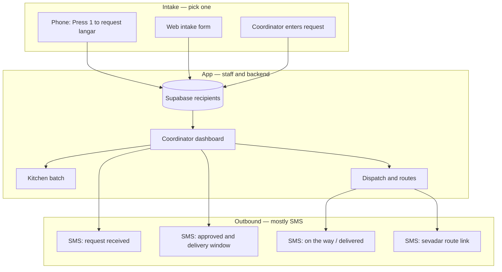
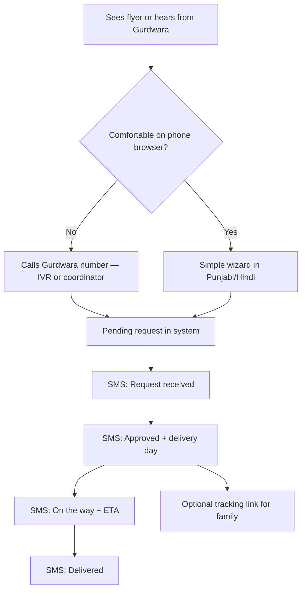

# Elderly-Friendly UI for Langar Seva

Guidance for making the recipient-facing experience accessible to elderly users. The current web intake flow is polished but assumes comfort with mobile browsers, typing, and English — barriers for many seniors in this community.

## Tracker

| Item | GitHub |
|------|--------|
| **Epic** | [#16 — Elderly-friendly recipient experience](https://github.com/sarina-aul/langar-seva/issues/16) |
| Phone-first intake | [#12](https://github.com/sarina-aul/langar-seva/issues/12) |
| Plain-language SMS status | [#13](https://github.com/sarina-aul/langar-seva/issues/13) |
| Recipient UI translations | [#14](https://github.com/sarina-aul/langar-seva/issues/14) |
| Intake accessibility pass | [#15](https://github.com/sarina-aul/langar-seva/issues/15) |

## Product channels

Langar Seva is a **multi-channel operations platform**, not a single website everyone must use. Different people touch different surfaces; all intake paths write into the same Supabase database and flow through coordinator review.

**One-line framing:** *Operations platform for coordinators, with phone-first intake for seniors and web/SMS for everyone else.*

### Who uses what

| Who | Channel | Role |
|-----|---------|------|
| Elderly recipient | **Phone (IVR)** or call coordinator | Request langar — no browser, minimal typing |
| Caregiver / family | **Web intake form** (optional) | Submit full address and details on someone's behalf |
| Coordinator | **Web app (staff login)** | Approve requests, complete IVR gaps, dispatch routes, handle exceptions |
| Kitchen | **Web app (staff login)** | Mark batches ready, meal counts |
| Sevadar (driver) | **SMS magic link** | Route sheet on phone — no staff login required |
| Recipient (delivery day) | **SMS** (+ optional tracking link) | Plain-language status; link is optional for families |

### How channels connect

IVR and the web form are **intake front doors**. The app is the **system of record and control center** — approve, route, deliver, track, rebalance. Replacing the WhatsApp group chat with IVR does not replace the app; it replaces unstructured group messages with structured `pending` rows coordinators already manage.

### What IVR does vs what the app does

| IVR is good for | App is required for |
|-----------------|---------------------|
| “Press 1 to request langar” | Approving and editing recipient records |
| Capturing caller phone and intent | Full address, postal code, routing data |
| Short menus in English / Punjabi / Hindi | Building route bundles and assigning sevadars |
| After-hours request capture | Kitchen workflow and batch readiness |
| SMS confirmation after the call | Delivery-day status, exceptions, rebalance |

Typical IVR flow: caller presses 1 → system creates a **`pending`** recipient (phone + defaults) → **SMS**: *“Request received — a coordinator will call to confirm your address.”* → coordinator completes the record in the app → same approve → dispatch → SMS lifecycle as web intake.

### Who still needs the web app?

| User | Uses full web app? |
|------|-------------------|
| Elderly recipient | **Rarely** — phone + SMS is enough |
| Adult child / caregiver | **Sometimes** — intake form or tracking link |
| Coordinator, kitchen, admin | **Always** — primary product surface |
| Sevadar | **Light** — route page from SMS link only |

Most elderly recipients never open the web UI. They need **phone + SMS in their language**. The web UI remains an optional, simplified path for caregivers and tech-comfortable seniors — see [Target experience for elderly recipients](#target-experience-for-elderly-recipients) below.

Pilot scope note: IVR is **post-pilot / v1.1** (Tier 3). The [go-live checklist](go-live-checklist.md) focuses on SMS tracking and manual dispatch first; this section documents the long-term channel model so intake work (phone, web, coordinator) is not confused with “building a recipient website.”

## What works well for older adults

| Principle | What it means |
|-----------|----------------|
| **Large, plain text** | Body text at least 18–20px; headings clearly bigger. Sans-serif for labels and instructions. |
| **High contrast** | Dark text on light background; avoid low-contrast gray/italic as the main reading style. |
| **Big tap targets** | Buttons and choices at least 48×48px, with clear spacing between them. |
| **One thing at a time** | Short steps with a visible progress indicator (“Step 2 of 4”), not one long scrolling form. |
| **Obvious affordances** | Full bordered fields and buttons — not thin underlines that look like decoration. |
| **Plain language** | Short sentences; explain community terms (“coordinator,” “sevadar”) in one line. |
| **Forgiving input** | Optional fields stay optional; smart defaults; “I don't know” / “Not sure” everywhere. |
| **Phone-first, not web-first** | Call to request, SMS replies, voice — not “find this URL and fill out 15 fields.” |
| **Human backup always visible** | “Call us: [number]” on every screen. |
| **Status in simple words** | “Your meal is on the way — about 30 minutes” beats “Route progress: en route.” |

## Where the app falls short today

### 1. Intake form is too long and dense

Recipient path: home → one long form (4 sections) → confirmation.

Pain points:

- Required unit/buzz field (must type `"none"` if not applicable)
- Native `<select>` dropdowns — hard on mobile for shaky hands
- Small radio buttons (~16px) with contact preference in a horizontal row
- Long consent paragraph in a checkbox

**Relevant files:** `web/src/components/IntakeForm.tsx`, `web/src/components/IntakeForm.css`

### 2. Typography works against readability

Form labels use 10px uppercase monospace (`0.625rem`); much secondary copy is italic serif at ~60% opacity. Readable for design; hard for aging eyes.

**Relevant files:** `web/src/components/IntakeForm.css`, `web/src/index.css`

### 3. Touch targets are borderline

Primary CTAs meet ~44px minimum; secondary controls (back button, radios, checkboxes) do not.

### 4. Web-only self-service

No login is good, but everything assumes opening a link, scrolling, typing an address, and submitting. For many elderly recipients, **phone call to coordinator** is the real intake channel.

### 5. Language preference ≠ translated UI

The form collects preferred language (Punjabi, Hindi, etc.) for coordinator callback, but **the UI is English only**.

**Relevant file:** `web/src/lib/recipientLabels.ts`

### 6. Tracking is web-centric

Tracking page has large status text (good), but updates depend on opening an SMS link in a browser. Phone-preferring seniors benefit more from **plain SMS status** or a **phone call**.

**Relevant file:** `web/src/pages/TrackingPage.tsx`

## Recommended features (prioritized)

### Tier 1 — Highest impact

1. **“Call to request” as primary CTA** — Big button on home: *Call [Gurdwara number] — we'll register you.*
2. **Coordinator-assisted intake** — Staff enters the request; recipient never touches the web UI.
3. **SMS-first status updates** — Plain-language texts without requiring a link:
   - *“Your langar request was received.”*
   - *“Approved — delivery [day/window].”*
   - *“On the way — about 25 minutes.”*
   - *“Delivered. Waheguru Ji.”*
4. **Translated UI** — At minimum Punjabi and Hindi for home, form, confirmation, and tracking.
5. **Step-by-step wizard** — One question per screen with big Next/Back buttons.

### Tier 2 — Web path usable for seniors who use it

6. **“Simple mode” toggle** — Larger text (1.25×), higher contrast, sans-serif, bigger buttons; persist in `localStorage`.
7. **Big tappable cards instead of dropdowns** — e.g. household size as large buttons.
8. **Make unit/buzz optional** — Default empty; helper: *“Leave blank if not applicable.”*
9. **Simpler consent** — Short line + link to full privacy text.
10. **Always-visible help** — Sticky footer: *Need help? Call XXX* on every recipient screen.

### Tier 3 — Nice to have

11. **Voice / IVR intake** — “Press 1 to request langar” (e.g. Twilio Voice)
12. **Senior priority flag** — See `docs/delivery-routing-plan.md` (priority flags for seniors)
13. **Large-print printable flyer** — QR + phone number for families
14. **Recurring household profile** — Request once; coordinator re-approves weekly
15. **Family/caregiver proxy** — Adult child submits on behalf of parent

## Target experience for elderly recipients

Most elderly users never need the web app. They need **phone + SMS in their language**, with the web UI as an optional simplified path for caregivers or tech-comfortable seniors.

## Quick wins (incremental)

1. Add **Call us** button above “Request a meal” on `RecipientHome`
2. Bump label size to **16px+**; drop uppercase mono on form labels
3. Increase radio/checkbox size to **24px+** with full-row tap targets
4. Split `IntakeForm` into **3–4 wizard steps** with progress
5. Make **unit/buzz optional**
6. Send **plain SMS status** in addition to tracking links

## Design note

Existing tokens (warm cream, dignified tone) can stay. Elderly-friendly UI does not need to look clinical — it means **bigger type, clearer controls, fewer steps, and phone/SMS as equal citizens to the web form**.

## Related docs

- `docs/go-live-checklist.md` — SMS and tracking pilot readiness
- `docs/delivery-tracking-next-steps.md` — Client tracking via SMS links
- `docs/delivery-routing-plan.md` — Senior priority flags (planned)
- Twilio Voice / IVR intake — planned v1.1; see [Product channels](#product-channels) above
