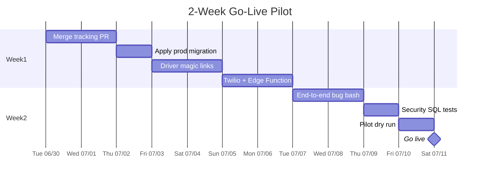
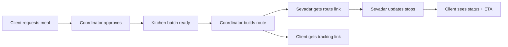
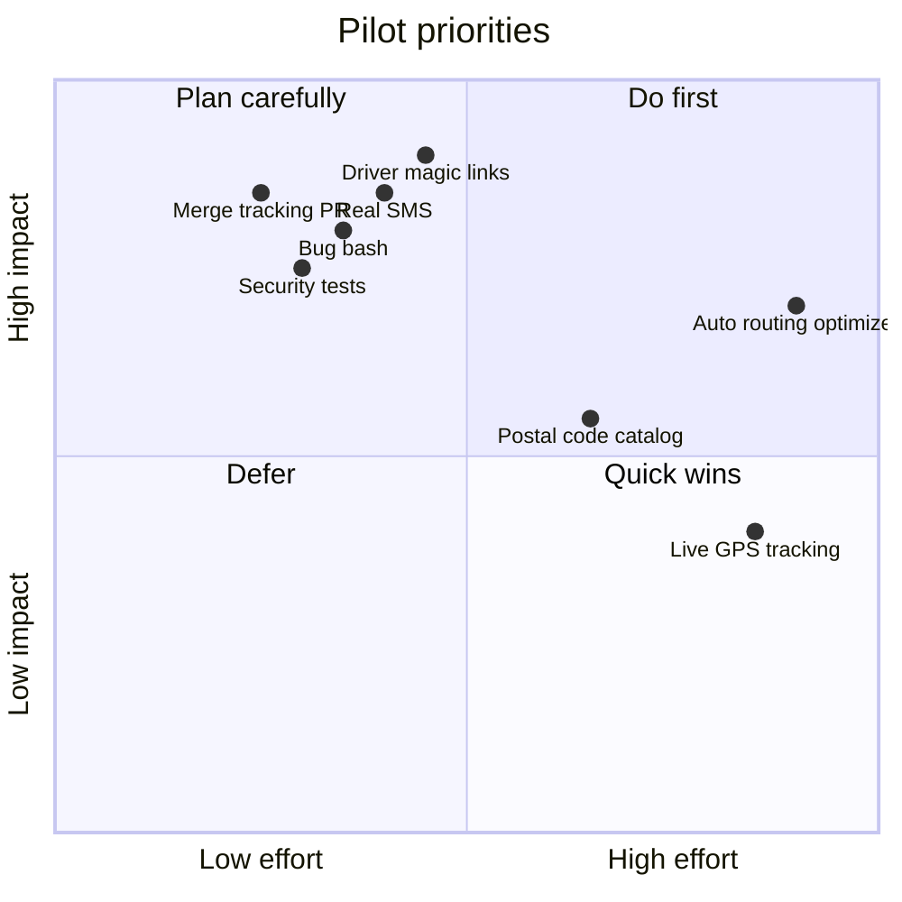

# Go-Live Checklist — 2-Week Pilot

Target: **fully operational v1** for a controlled pilot — manual dispatch, client tracking, driver links, real SMS. Auto routing optimizer is **out of scope** for this pilot.

**Last reviewed:** 2026-06-26

Related trackers: [#6](https://github.com/sarina-aul/langar-seva/issues/6) · [#9](https://github.com/sarina-aul/langar-seva/issues/9) · [#10](https://github.com/sarina-aul/langar-seva/issues/10) · [Board](https://github.com/users/sarina-aul/projects/1)

### Maintenance

| Mechanism | Frequency | What it does |
|-----------|-----------|--------------|
| [GitHub Action](https://github.com/sarina-aul/langar-seva/blob/main/.github/workflows/go-live-checklist-reminder.yml) | Every Monday | Posts a review reminder on [#10](https://github.com/sarina-aul/langar-seva/issues/10) |
| Cursor rule `.cursor/rules/go-live-checklist-maintenance.mdc` | When delivery code/docs change | Agent updates this file and checkboxes |
| Manual | After each merge or pilot test | Refresh dates, charts, and go/no-go table |

---

## Pilot scope (v1)

| In scope | Out of scope (v2) |
|----------|-------------------|
| Manual route bundles from dispatch | Auto route optimizer |
| Client tracking via private SMS link | Live driver GPS / map |
| Driver magic links (no staff login) | Postal-code routing catalog |
| Real SMS (Twilio) | Dynamic mid-route rebalance |
| 1 batch · 2–3 sevadars · 10–20 stops | Multi-gurdwara / multi-city |

---

## Timeline overview

---

## End-to-end flow (what must work)

---

## Week 1 — Ship the loop

### Day 1–2: Merge and deploy foundation

- [ ] Open PR for local tracking work (migration, pages, Edge Function, tests)
- [ ] Code review + merge to `main`
- [ ] Apply `20260626010600_delivery_tracking.sql` to production Supabase
- [ ] Deploy `send-delivery-tracking-sms` Edge Function
- [ ] Smoke test: `/track/:token` on production URL

### Day 3–4: Driver access

- [ ] Add driver magic links (hashed token, expiry, revoke)
- [ ] Driver page scoped to one route only
- [ ] Coordinator: resend / revoke driver link from dispatch
- [ ] Test: invalid / expired driver link shows nothing

### Day 5–7: Real SMS

- [ ] Configure Twilio env vars on Supabase
- [ ] Send client tracking link via SMS
- [ ] Send driver route link via SMS
- [ ] Log failures in `delivery_notifications`; show in dispatch UI
- [ ] Dev fallback still works when Twilio not configured

---

## Week 2 — Harden and pilot

### Day 8–9: Bug bash

Run this path manually twice with test phones:

| Step | Page | Pass? |
|------|------|-------|
| 1 | Public intake → pending | ☐ |
| 2 | Approve recipient | ☐ |
| 3 | Kitchen → batch ready | ☐ |
| 4 | Dispatch → create route | ☐ |
| 5 | Send client tracking SMS | ☐ |
| 6 | Send driver route SMS | ☐ |
| 7 | Driver marks stop nearby / delivered | ☐ |
| 8 | Client tracking page updates | ☐ |
| 9 | Privacy: client sees no driver phone / full route | ☐ |

Known areas to watch:

- [ ] Tracking token hash mismatch after resend (reseed or regenerate correctly)
- [ ] Expired / revoked links return empty (no data leak)
- [ ] Contact pref = phone only → SMS skipped gracefully
- [ ] Route cancelled → tracking links stop working

### Day 10: Security tests

- [ ] Run `scripts/test-delivery-tracking.sql` against prod or staging
- [ ] Confirm anon cannot read `recipients`, `dispatch_routes`, `sevadars`
- [ ] Confirm tracking RPC returns redacted fields only

### Day 11: Dry run

- [ ] One real batch at Glidden Gurdwara
- [ ] 2–3 sevadars, 10–20 stops (manual route order)
- [ ] Coordinator on-call for exceptions
- [ ] Capture notes for v1.1 fixes

### Day 12: Go live

- [ ] Go / no-go checklist signed off (below)
- [ ] First live delivery day

---

## Go / no-go checklist

All must be **yes** before live recipients depend on the system:

| # | Criterion | Ready? |
|---|-----------|--------|
| 1 | Tracking code merged and migration applied | ☐ |
| 2 | Driver magic links work without staff login | ☐ |
| 3 | Real SMS sends and failures are visible | ☐ |
| 4 | Client tracking page works from SMS link on mobile | ☐ |
| 5 | Security SQL tests pass | ☐ |
| 6 | Dry run completed with no P0 bugs | ☐ |
| 7 | Coordinator runbook agreed (who fixes what live) | ☐ |

---

## Risk vs effort

---

## After pilot (v1.1 → v2)

1. Postal codes + sevadar routing profiles ([#9 Phase 5](https://github.com/sarina-aul/langar-seva/issues/9))
2. Route suggestion engine ([#8](https://github.com/sarina-aul/langar-seva/issues/8))
3. ETA tuning from real stop times
4. Coordinator rebalance on cancellation

---

## Quick links

- [Delivery tracking next steps](delivery-tracking-next-steps.md)
- [Delivery routing plan](delivery-routing-plan.md)
- [GitHub board](https://github.com/users/sarina-aul/projects/1)
