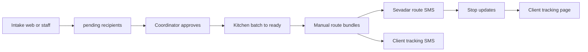

# Feature Specification: Langar Seva Platform (v1 Pilot)

**Feature Branch**: `000-langar-seva-platform` (reference — not a git branch)

**Created**: 2026-06-27

**Status**: Active reference (as-built + pilot scope)

**Input**: Platform overview for the Seva Eats / Langar Seva web + Supabase stack

## Product summary

Langar Seva is a **multi-channel operations platform** for free langar meal delivery. Coordinators
run intake review, kitchen batches, manual dispatch, and delivery-day SMS from a staff web app.
Recipients request meals via web (today) or phone IVR (planned v1.1); sevadars use SMS magic
links for route sheets without staff login.

**Framing:** *Operations platform for coordinators, with phone-first intake for seniors and
web/SMS for everyone else.* (see `docs/elderly-friendly-ui.md`)

## Actors

| Actor | Primary channel | Goal |
|-------|-----------------|------|
| Elderly recipient | Phone (future IVR) or caregiver web | Request langar with minimal friction |
| Caregiver / family | Web intake `/` | Submit full details on someone's behalf |
| Coordinator | Staff app `/staff/*` | Approve requests, dispatch routes, handle exceptions |
| Kitchen staff | `/staff/kitchen` | Advance batch stages, meal counts |
| Sevadar (driver) | SMS route magic link | Deliver stops, update status |
| Recipient (delivery day) | SMS + optional `/track/:token` | Plain-language delivery status |

## End-to-end flow (v1 pilot)

**Pilot constraints** (`docs/go-live-checklist.md`): manual dispatch, 10–20 stops, 2–3 sevadars,
one batch; no auto route optimizer, no live GPS.

## User Scenarios & Testing *(platform-level)*

### User Story 1 - Recipient requests a meal (Priority: P1)

A community member submits an intake request without creating an account and sees confirmation
that a coordinator will review it.

**Independent Test**: Submit web form at `/`; row in `recipients` with `status = pending`; confirmation UI.

**Linked spec**: [002-recipient-web-intake](../002-recipient-web-intake/spec.md)

---

### User Story 2 - Coordinator runs delivery day (Priority: P1)

A coordinator logs in, approves pending households, marks kitchen ready, builds routes, sends
SMS links, and monitors delivery progress.

**Independent Test**: Full path login → recipients → kitchen → dispatch → tracking SMS.

**Linked specs**: [004-coordinator-recipients](../004-coordinator-recipients/spec.md),
[005-kitchen-batch](../005-kitchen-batch/spec.md),
[006-dispatch-delivery-tracking](../006-dispatch-delivery-tracking/spec.md)

---

### User Story 3 - Kitchen tracks tonight's batch (Priority: P2)

Kitchen admin advances batch stages and meal counts; coordinator receives ready notification.

**Independent Test**: Login as `kitchen@example.com`; advance batch; coordinator sees banner.

**Linked spec**: [005-kitchen-batch](../005-kitchen-batch/spec.md)

---

### User Story 4 - Sevadar delivers without staff login (Priority: P2)

Driver opens route from SMS link, updates stops; recipients see status on tracking page.

**Independent Test**: Magic link opens single route only; stop update reflects on `/track/:token`.

**Linked spec**: [006-dispatch-delivery-tracking](../006-dispatch-delivery-tracking/spec.md)

---

### User Story 5 - Phone-first intake (Priority: P3 — v1.1)

Elderly caller presses 1 on hotline; pending row + SMS; coordinator completes address by phone.

**Independent Test**: See [001-ivr-intake](../001-ivr-intake/spec.md)

## Requirements *(platform)*

### Functional Requirements

- **FR-P01**: System MUST support anonymous recipient intake with RLS limiting anon to `pending` INSERT only.
- **FR-P02**: System MUST support invite-only staff auth with roles `coordinator` and `kitchen_admin` via `app_metadata.role`.
- **FR-P03**: All intake channels MUST write to the same `recipients` table and share coordinator review.
- **FR-P04**: Coordinators MUST approve or reject pending requests before dispatch assignment.
- **FR-P05**: Kitchen MUST expose batch stage workflow through ready/dispatched lifecycle.
- **FR-P06**: Dispatch MUST support manual route bundles and SMS for driver + client tracking links.
- **FR-P07**: SMS MUST use plain language; failures MUST be logged, not silently dropped.

### Non-Functional Requirements *(constitution-driven)*

- **NFR-P-SEC**: RLS on all tables; service role only in Edge Functions; see constitution Principle I.
- **NFR-P-UX**: Recipient UX follows `docs/elderly-friendly-ui.md`; shared labels in `recipientLabels.ts`.
- **NFR-P-TEST**: `npm run lint` + `npm run build`; SQL scripts under `scripts/` for RLS and tracking.
- **NFR-P-PERF**: Responsive at pilot scale (10–20 stops).

### Key Entities

- **Recipient** — intake + approval lifecycle (`pending` → `approved` / `rejected` → delivery)
- **Batch** — kitchen production run for a date
- **Dispatch route** — coordinator-built bundle assigned to a sevadar
- **Route stop / delivery tracking** — per-recipient delivery state and client token

## Success Criteria *(pilot)*

- **SC-P01**: Coordinator completes intake → dispatch → tracking loop in one session without DB edits.
- **SC-P02**: Anonymous users cannot read or modify existing recipient rows (verified by SQL tests).
- **SC-P03**: Real SMS sends succeed for pilot test phones when Twilio configured.
- **SC-P04**: Go-live checklist Week 1–2 items pass on staging before production pilot.

## Technology stack

| Layer | Choice |
|-------|--------|
| Frontend | React 19, Vite, TypeScript (`web/`) |
| Backend | Supabase Postgres, Auth, Realtime, Edge Functions |
| SMS / Voice | Twilio (SMS shipped; Voice in 001-ivr-intake) |
| Design | Magic Patterns handoff per `INTEGRATION.md` |

## Out of scope (v1 pilot)

- Auto route optimizer
- Live driver GPS map
- Postal-code routing catalog
- Multi-gurdwara / multi-city
- Public staff signup
- Full recipient UI i18n (language preference captured for coordinator callback)

## Assumptions

- Single gurdwara / local pilot geography
- Coordinators available to complete IVR-incomplete records by phone (when IVR ships)
- Supabase local dev uses Docker; production on linked Supabase project

## Feature spec map

See [`specs/README.md`](../README.md) for the full catalog and Speckit workflow.
